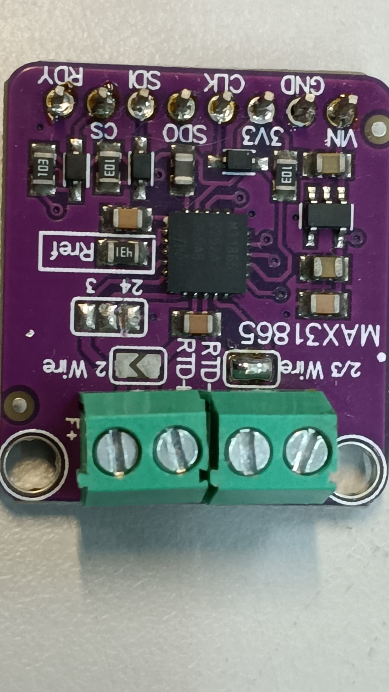
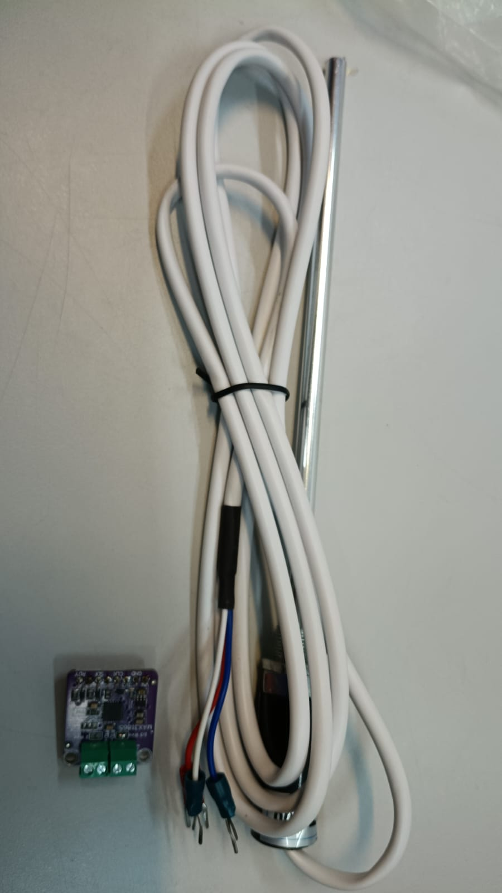
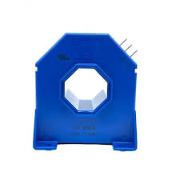
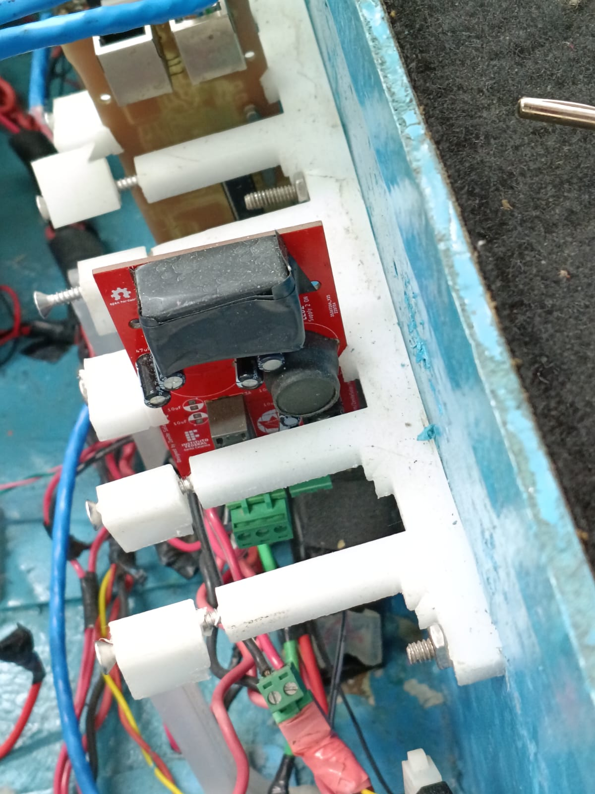

Etapa 1
#######

.. contents::
   :local:
   :depth: 2

Visão geral
***********

A primeira etapa abordará os requisitos e as tecnologias do sistema embarcado que comporá o barco Guarapuvu II, da equipe de competição Zênite Solar do IFSC, a ser desenvolvido durante a unidade curricular Projeto Integrador III do curso de Engenharia Eletrônica.

Além da definição dos requisitos e da tecnologia a ser empregada, serão apresentados:

+ Desenho representativo do barco com os aspectos relevante para o projeto;
+ Fluxograma do funcionamento do sistema;
+ Limitações físicas da PCB a ser desenvolvida;
+ Inventário de componentes necessários para a execução das próximas etapas.

Desenvolvimento
***************

Levantamento de Requisitos
==========================

**Escopo do Sistema**

O sistema contempla:

+ Monitoramento de temperatura em três divisões críticas do barco (Banco de baterias, controladores de carga e Motor);
+ Medição de corrente elétrica na entrada do motor;
+ Condicionamento e conversão dos sinais analógicos para digital;
+ Comunicação dos dados via rede CAN.

**Requisitos Funcionais**

+ Deve ser possível realizar a aquisição de temperatura de até 70°C em três pontos distintos;
+ Deve ser possível realizar a medição de corrente até 200 A;
+ O sistema deve realizar a leitura contínua dos sensores de temperatura e corrente;
+ O sistema deve aplicar condicionamento de sinal adequado para leitura do sensores;

   **Conversão de Sinais**

+ O sinal analógico deve ser convertido com a precisão, resolução e frequência suficientes para seu aproveitamento.

   **Processamento de Dados**

+ O sistema deve processar os dados adquiridos, aplicando por exemplo: Filtragem de ruído, conversão para unidades físicas (°C e A);
+ O sistema deve validar os dados adquiridos, identificando possíveis falhas de sensores.

**Requisitos não Funcionais**

+ O sistema deve atualizar as medições com uma frequência mínima de 20 Hz para as temperaturas e 24 kHz para a corrente;
+ A latência entre aquisição e transmissão não deve exceder 50 ms.
+ O sistema deve operar de forma contínua durante toda a operação do barco.
+ O sistema deve ser robusto a interferências eletromagnéticas (EMI/EMC), típicas de ambientes com conversores e motores elétricos.
+ O sistema deve detectar falhas nos sensores e comunicar estados de erro via CAN.
+ O sistema deve possuir proteção contra surtos e ruídos elétricos.
+ A medição de temperatura deve ter precisão mínima de 0,5 °C.
+ A medição de corrente deve ter erro o menor erro possível.
+ As mensagens devem seguir um formato padronizado e documentado.
+ O sistema deve ter baixo consumo energético para não afetar a autonomia do barco.
+ O sistema deve suportar: Umidade elevada, vibração mecânica, temperaturas variáveis, corrosão.
+ O sistema deve permitir fácil substituição dos sensores.
+ O firmware deve permitir atualização para melhorias futuras.

**Restrições Funcionais**

+ Deve-se usar o sensor de temperatura **PT100** com 3 fios.
+ Deve-se usar o sensor de corrente de efeito *Hall* **LEM LA 205-S**.
+ A versão do protocolo CAN deve ser a versão atual do barco (2.0B).
+ O firmware deve ser escrito na linguagem de programação C.
+ O microcontrolador usado deve ser o STM32F401.

Tecnologias do Projeto
======================

**Aquisição de Temperatura**

Para as aquisições de temperatura serão utilizados o sensor **PT100**, em conjunto com um módulo contendo o conversor analógico-digital **MAX31865**, específico para essa aplicação. Esse módulo dispensa a necessidade de pré-amplificação e filtragem do sinal, simplificando o processo de medição. A frequência de atualização mínima de cada sensor será de 20 Hz.

**Medição de Corrente**

Para a medição de corrente será utilizado o sensor de efeito *Hall* **LA 205-S** da **LEM**. A saída de corrente fornecida pelo sensor deve ser transduzida para um nível de tensão adequado, garantindo tanto a precisão da medida quanto a compatibilidade com o ADC empregado.
Além disso, será necessário implementar um filtro passa baixa compatível com a frequência de operação máxima de 12 kHz do motor, assegurando a integridade do sinal adquirido. A fim de respeitar o critério de *Nyquist*, a frequência de amostragem deve ser maior que 24 kHz.

**Conversão de Sinais**

O sistema deve converter todos os sinais analógicos para formato digital, utilizando os conversores A/D do microcontrolador **STM32F401** para a medição de corrente e o **MAX31865** para a aquisição de temperatura. A resolução da conversão deve ser suficiente para garantir a precisão adequada das medições. Na configuração atual do módulo, obtém-se uma resolução de 0.03125 °C para a temperatura e, para a corrente, considera-se que a corrente máxima de 200 A corresponde ao limite da escala de 12 bits e, portanto, a resolução é de 48,828 mA.

**Comunicação CAN**

O sistema deve transmitir os dados referentes as grandezas medidas via rede CAN na versão atual do barco (2.0B). A frequência de transmissão será limitada pela disponibilidade da rede CAN. Quando as medidas forem solicidadas, as últimas medidas imediatas de corrente e tensão serão enviadas, atentando-se ao limite de 8 bytes do campo de dados.

Desenho Representativo do Barco
===============================

Fluxograma do Funcionamento do Sistema
======================================

Limitações Físicas da(s) Placa(s)
=================================

A placa de circuito impresso a ser desenvolvida deve se enquadrar no suporte reservado a placas do mesmo tipo. Suas dimensões máximas devem ser de 15 cm de comprimento por 6 cm de largura.

Inventário de Componentes necessários
=====================================

Considerando que a etapa 1 aborda uma visão macroscópica do projeto, é possível que haja a adição posterior de componentes para a sua finalização, principalmente no que se refere aos elementos a serem inseridos na PCB. A seguir, são apresentados os componentes previstos para utilização, pelo menos até a terceira etapa do desenvolvimento.

+ 3 unidades do módulo conversor **MAX31865**;
+ 3 unidades do sensor **PT100**;
+ 1 unidade do sensor de efeito *Hall* **LEM LA 205-S**;
+ Resistores variados;
+ Capacitores variados;
+ 1 Amplificador operacional *rail-to-rail*;
+ 1 kit de desenvolvimento baseado no microcontrolador STM32F401;
+ 1 regulador linear (Vin >= 18 V, Vout = 3V3);
+ 2 unidades de modulo de comunicação CAN.

Referências (links/datasheets/livros)
*************************************

- `Zênite Solar GitHub <https://github.com/ZeniteSolar>`_

