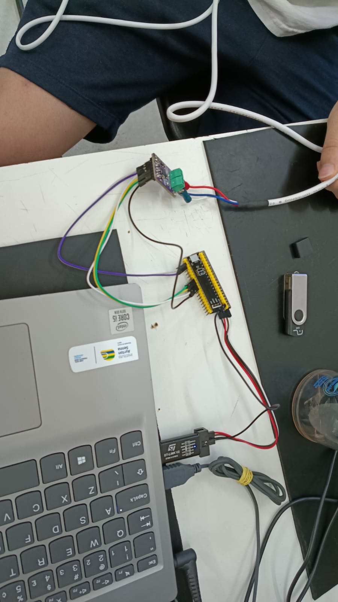
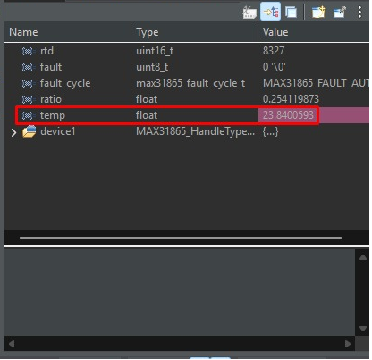
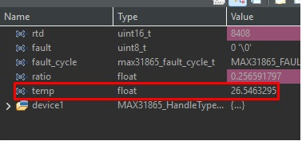
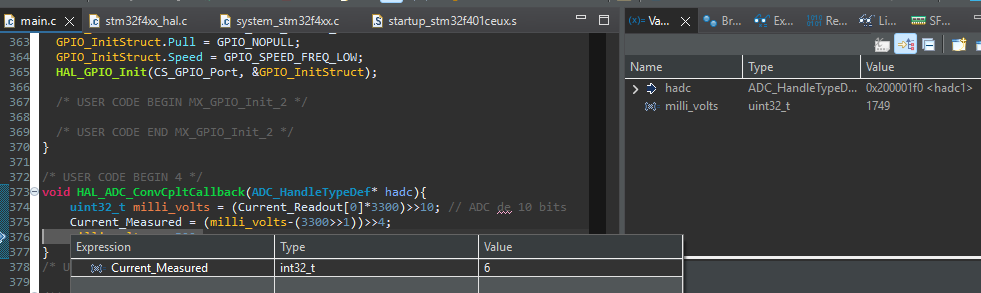
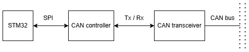
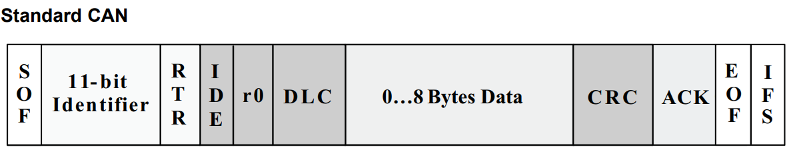

Etapa 2
#######

.. contents::
   :local:
   :depth: 2

Visão geral
***********

A etapa 2 abordará os testes dos sensores de temperatura e corrente em placas de desenvolvimento e a definição da arquitetura do protoloco CAN que será implementado no sistema embarcado referênte ao projeto em questão.

Desenvolvimento
***************

Apresentar o desenvolvimento da etapa contendo detalhes de implementação (se houver) de hardware e software. Adicionar pesqusisas realizadas bem como testes realizados.

Testes
======

**Aquisição de Temperatura com o MAX 31865**

Foi conectado o sensor MAX 31865 por SPI ao blackpill e requisitada sua leitura. Testado com temperatura ambiente de 22°C e temperadura levemente elevada por fricção

**Medição de Corrente com LA 205-S**

Foi configurado o ADC do blackpill para uma frequência de amostragem de 120 kHz com 10 bits de precisão, foi então utilizada uma fonte linear para emular a tensão do shunt

Foi então calculada a corrente esperada no pino com offset ($I_{real}=(V_{ADC}-V_{offset})/R_{shunta}$), como $V_{offset}=V_{dd}/2$ e $R_{shunt}=16$, sendo calculada pela seguinte fórmula dentro do callback do ADC:

.. code:block:: C
	uint32_t milli_volt = (ADC_reading*3300)>>10;
	Current_Measured = (milli_volt-(3300>>1))>>4;

Sendo `Current_Measured` a corrente do secundário em $mA$

Valor de corrente medido:

O valor da variável milli_volt está coerente com o esperado do valor da fonte, sendo que $6mA$ no resistor de shunt resultaria em uma tensão de $6\cdot 16=96mV$ - após amplificação, o pino do ADC mede $96+3300/2=1746mV$, conforme esperado

Para os testes com o sensor LEM LA205S com correntes positivas e negativas, foi utilizada a seguinte topologia:

..image :: images/current_signal_conditioning_eschem.png
	:scale: 30%

Temos que a saída do circuito é igual a $V_{ADC}=V_{Shunt}+V_{off}=I_{Shunt}R_{Shunt}+V_{off}$
	
Tensão ADC medida de $1981mV (~21mA)$ e $673mV(~-61mA)$ respectivamente

Arquitetura do Protocolo CAN
============================

O microcontolador STM32f401 (blackpill) não possui o perírico CAN nativo, logo, se faz necessário uma interface controladora que torna possível a implementação do protocolo sem gerar custos adicionais a CPU do microcontrolador.
A interface do microcontrolador com a rede CAN será feita por intermédio de dois circuitos integrados:

+ MCP2515 -> Controlador CAN
+ TJA1050 -> Transceptor CAN

A implemetação física pode ser observada pelo diagrama a seguir:

   
O protocolo CAN a ser impletamentado pertence a versão 2.0A, conhecido também como "standard CAN".
Seu dataframe pode ser observado na imagem abaixo:

   
Para o projeto em questão é necessário que o microcontrolador somente envie mensagens.

Para implementar a arquitura utilizando o controlador CAN MCP2515 é necessário, através do barramento SPI:

+ Configurar o *baud rate* (registradores CNF[1:3])
+ Habilitar feedback de envio (registrador CANINTE) -> permite debug
+ Escolher modo de operação (Normal, sleep, loopback...) (registrador CANCTRL)

+ Configurar o *identifier* de 11 bits (registradores TXBnSIDH e TXBnSIDL)
+ Escolher o tamanho do pacote de dados (0 a 8 bytes) (registrador TXBnDLC)
+ Carregar dados (registradores TXBnD[0:7])
+ Escolher o buffer que será transmitido (registrador TXRTSCTRL)
+ Requisitar envio do buffer (registrador TXBnCTRL)

Os demais campos do dataframe do protocolo tais como CRC, ACK e EOF serão calculados e gerados pelo controlador CAN.

O nó da rede CAN em questão possuirá 2 *identifiers*:

+ Id zzz contendo as aquisições de temperatura.
+ Id xxx contendo as medições de corrente.

As mensagens serão divididas da seguinte forma:

	**Id zzz**

	+ Frequência de envio = 1 - 5 Hz;
	+ Total bytes = 4;
	+ bits[31:30] -> informa status da aquisição ou erro nos sensores (00b = sem falhas; 01b = falha no sensor do motor; 10b = falha no sensor dos controladores; 11b = falha no sensor das baterias);
	+ bits[29:20] -> Temperatura das baterias em °C (uint10_t);
	+ bits[19:10] -> Temperatura dos controladores de carga em °C (uint10_t);
	+ bits[9:0]   -> Temperatura do motor em °C (uint10_t).
	
	**Id xxx**

	+ Frequência de envio = 100 - 130 Hz;
	+ Total bytes = 4;
	+ bits[31:25] -> informa status da aquisição ou erro nos sensores (0000000b = sem falhas; 0000001b = falha de aquisição de corrente de pico; 0000010b = falha de aquisição de corrente RMS);
	+ bit[24]     -> informa sentido predominante da corrente (1 para positivo);
	+ bits[23:12] -> Corrente RMS em mA (uint12_t);
	+ bit[11]     -> Sentido da corrente de pico (1 para positivo);
	+ bits[10:00] -> Corrente de pico em mA (uint11_t).

Referências (links/datasheets/livros)
*************************************

- `MCP2515 documentação <https://www.microchip.com/en-us/product/mcp2515>`_

- `Zênite Solar GitHub <https://github.com/ZeniteSolar>`_

