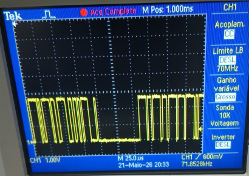
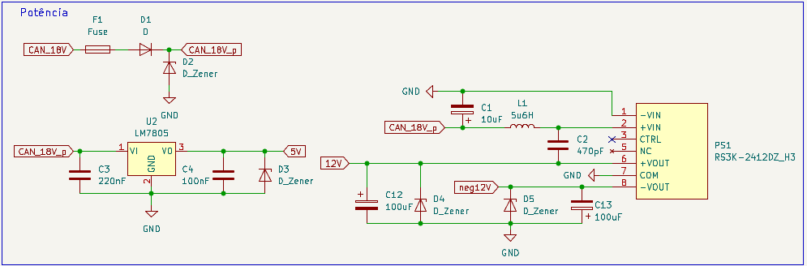
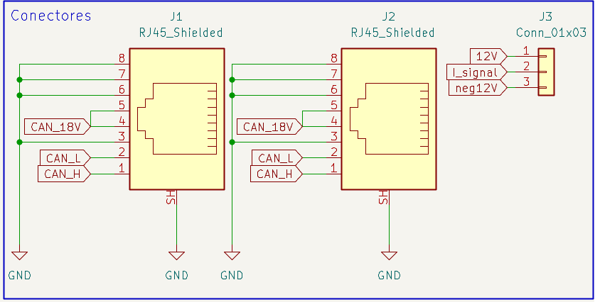
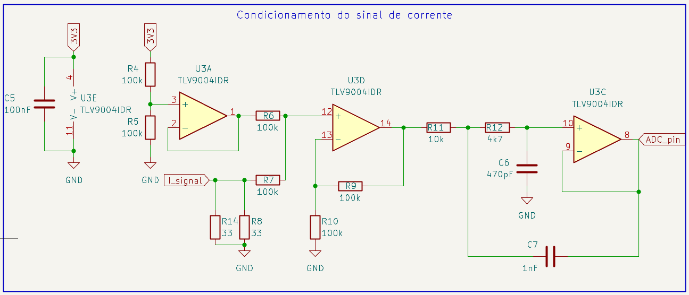
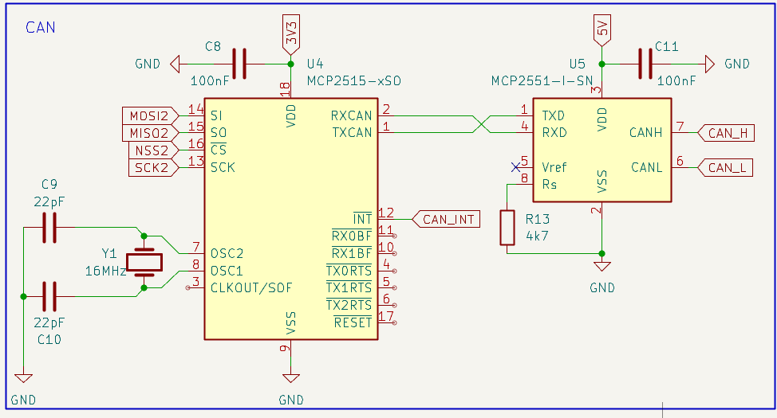
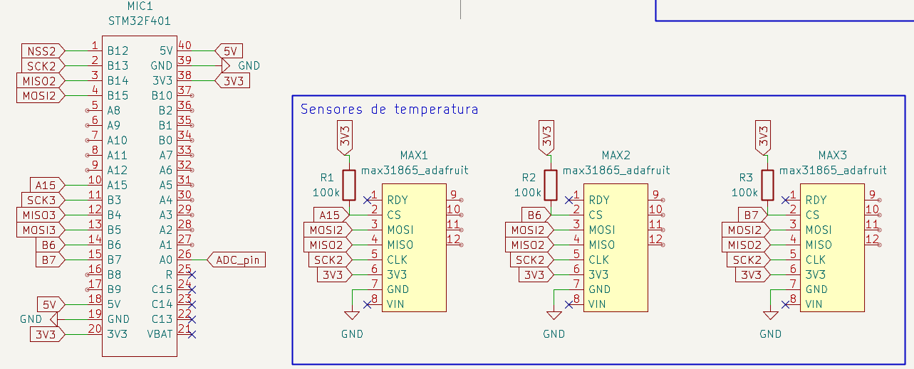

Etapa 3
#######

.. contents::
   :local:
   :depth: 2


Visão geral
***********

A Etapa 3 abordará a implementação do protocolo CAN, bem como a integração e os testes dos dados provenientes dos sensores em um mesmo firmware baseado em arquitetura RTOS. O objetivo é validar o envio correto das informações pelo barramento CAN.

Além disso, será abordado a elaboração do esquemático da placa de circuito impresso, juntamente com a definição dos critérios de desempenho do sistema, que serão avaliados na etapa seguinte.


Desenvolvimento
***************

Apresentar o desenvolvimento da etapa contendo detalhes de implementação (se houver) de hardware e software. Adicionar pesqusisas realizadas bem como testes realizados.


`Link para os Testes <Testes>`_

Implementação do Protocolo CAN
==============================

Documentar a implementação

Integração dos dados dos sensores à aplicação
=============================================

Documentar a integração das funcionalidades em um único arquivo (Firmware)

- `Link para o firmware </Firmware>`_


Teste da Rede CAN com Dados dos Sensores
========================================
Após implementação em código do `sensor de corrente </Testes/Sensor_RTOS/Core/Src/Current_Sensor.c>`_ 
e dos `sensores de temperatura </Testes/Sensor_RTOS/Core/Src/Temperature_Sensor.c>`_, foi implementada 
à partir do `driver do MCP2515 </Testes/Sensor_RTOS/Core/Src/MCP2515_Driver.c>`_ a transmição dos 
dados dos sensores utilizando o protocolo CAN nos IDS 0x10 e 0x11. O teste foi realizado utilizando um 
`ESP 32 </Testes/ESP32devkit/ESP32MCP2515>`_ como nó receptor, com o blackpill STM atuando como 
nó transmissor enviando mensagens.

Segue uma imagem do teste da rede CAN, o osciloscópio mede a tensão diferencial da linha no módulo utilizado.


O ESP32 foi configurado para repassar as mensagems que recebe por SPI do MCP2515 para a porta 
serial, e o terminal do computador foi configurado para receber as mensagens. 
Abaixo temos um exemplo de mensagem recebida no terminal:
```
Mensagem CAN Recebida:
ID: 0x10
Data: ################
Mensagem CAN Recebida:
ID: 0x11
Data: ################
```

TODO: Comparativo entre os dados recebidos e esperados


Esquemático da PCI
==================

O projeto KiCad onde foi elaborado o esquemático pode ser encontrado em:  `Link para o Esquemático do Projeto </PCB/Modulo_corrente_temperatura_barco_Zenite>`_ 

O esquemático apresentado em partes nos próximos tópicos foi desenvolvido para atender aos requisitos do projeto, considerando:

- Níveis de tensão e corrente necessários para cada sensor e circuito integrado.



Na figura acima é possível observar elementos de proteção contra sobrecorrente e surtos de tensão, além de um regulador linear destinado à alimentação do microcontrolador e de um conversor estático responsável por suprir as necessidades do sensor de corrente utilizado.


- Conexão com a rede CAN, alimentação do módulo e do sensor de corrente.



Além dos conectores RJ45 padrão do barco foi necessário a previsão de um conector 3 pinos genérico para a alimentação e retorno do sinal em corrente do LA 205-s.

- Condicionamento do sinal de corrente do LA 205-s.



Observa-se na figura a presença de amplificadores operacionais configurados em diferentes topologias: buffer (para sinal de referência), somador não inversor (para obtenção do offset) e filtro ativo passa-baixa de segunda ordem.

   O circuito funciona de modo que:

   - 1,65 V na saída representam 0 A;
   - 3,3 V na saída correspondem a +200 A;
   - 0 V na saída equivalem a –200 A.
 
Ressalta-se que, atualmente, a frequência de corte do filtro encontra-se próxima de 120 kHz. No entanto, essa configuração pode ser ajustada posteriormente, mediante análise da forma de onda real da corrente do motor.

- Gerenciamento e envio de mensagens CAN.



Na figura acima obeserva-se os CIs responsáveis pelo gerenciamento do protocolo e transdução do sinal.

- Processamento de dados e transdução da temperatura.



Na figura acima observa-se a atribuição dos pinos no microcontrolador, além dos três módulos baseados no circuito integrado MAX31865. Ressalta-se que existe a possibilidade de substituir os módulos pelo próprio CI, entretanto, devem ser consideradas as restrições de fabricação da placa em virtude do encapsulamento do MAX31865.

Critérios de Desempenho
***********************

Os critérios de desempenho adotados para o projeto, que deverão ser medidos na próxima etapa, são:

- Tempo de execução de cada tarefa;
- Tempo de ocupação da CPU;
- Medição do WCET (Worst-Case Execution Time);
- Eficiência energética da placa;
- Exatidão das medidas de corrente e temperatura, para fins de validação do código.

Referências (links/datasheets/livros)
*************************************

- `nRF Connect SDK <https://developer.nordicsemi.com/nRF_Connect_SDK/doc/2.4.2/nrf/getting_started/modifying.html#configure-application>`_

- `Código de interface MCP2515 <https://github.com/eziya/STM32_SPI_MCP2515/tree/master>`_


