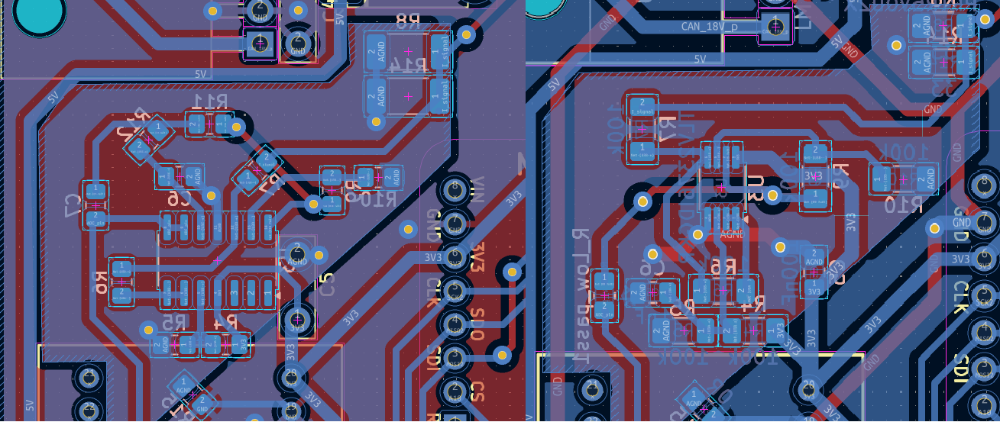
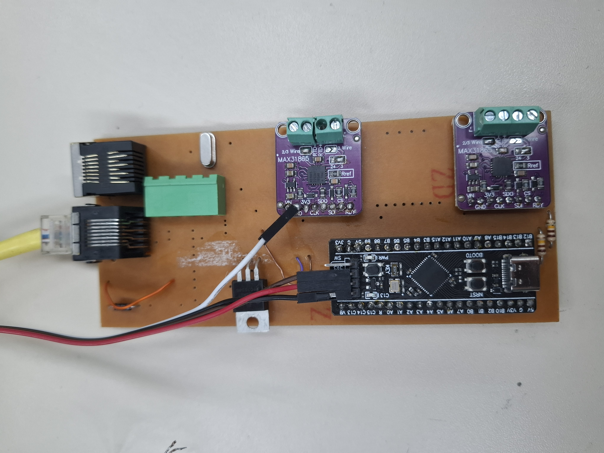
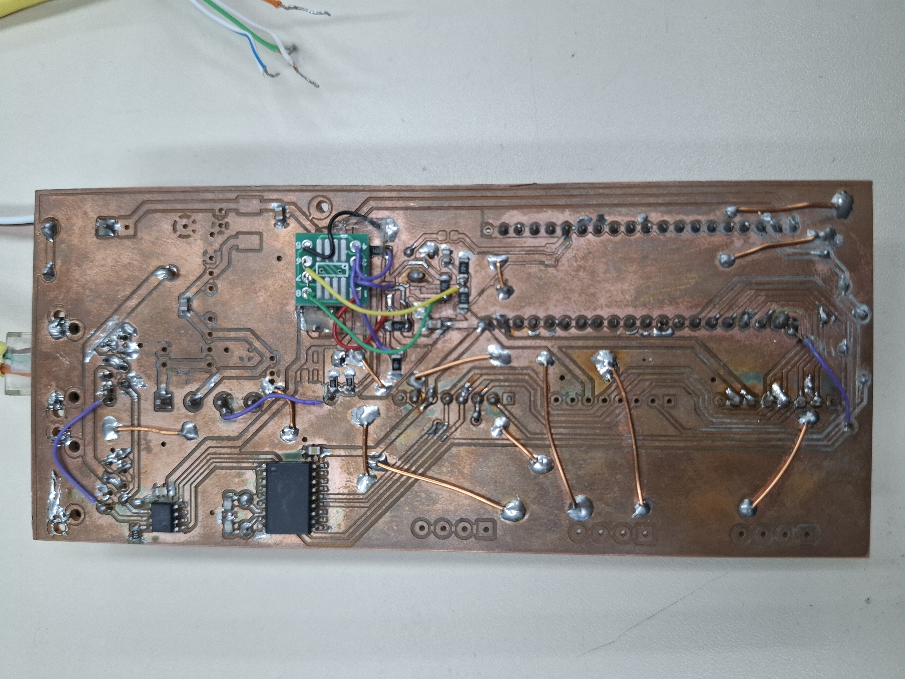

Etapa 4
#######

.. contents::
   :local:
   :depth: 2

Visão geral
***********

A Etapa 4 abordará projeto do layout e montagem da placa de circuito impresso que abriga o sistema embarcado. A partir da montagem da PCB serão verificados os critérios de desempenho definidos na Etapa 3, juntamente a validação do sistema e integridade dos dados no barco.

Desenvolvimento
***************

Layout da PCB
=============

Para a elaboração do *layout* foram priorizados os seguintes aspectos:

+ Alta densidade de componentes, visando aproveitar o espaço limitado;
+ Segmentação da placa em áreas relacionadas à potência (dissipação de calor e emissão de EMI), tratamento de sinais analógicos e trilhas de sinais digitais;
+ Dedicação de um plano de referência exclusivo para o condicionamento do sinal proveniente do sensor de corrente (visando diminuir erros e aumentar a precisão);
+ Priorização de componentes SMD;
+ As regras de desenho devem ser compatíveis com os limites da CNC do LPAE(IFSC);
+ Placa de face dupla, sendo a camada superior majoritariamente um plano de referência sólido.

Observando as condições de manufatura do IFSC, foram priorizados componentes SMD de tamanho mínimo equivalente ao encapsulamento SOIC para os circuitos integrados e 0805 para capacitores e resistores. O projeto desenvolvido no KiCad pode ser visualizado em: `Link para a versão 1 do projeto <https://github.com/GabrielMarodin/sensor-temperatura-corrente-can/tree/main/etapa_3/PCB/Modulo_corrente_temperatura_barco_Zenite>`_ .

No entanto, alguns componentes estavam indisponíveis e adaptações foram necessárias, como pode ser observado na imagem abaixo.

O amplificador operacional TLV9004, inicialmente idealizado, foi substituído pelo TLV2376, em um encapsulamento menor, mas plenamente compatível com os requisitos do projeto. A substituição também ocorreu com o filtro ativo anteriormente previsto que foi trocado por um filtro passivo RC passa-baixa. O *layout* adaptado no KiCad pode ser visualizado em: `Link para a versão 2 do projeto <https://github.com/GabrielMarodin/sensor-temperatura-corrente-can/tree/main/etapa_3/PCB/Modulo_corrente_temperatura_barco_Zenite-V02>`_ .

Montagem da PCB
===============

A fabricação da PCB foi realizada no LPAE com o auxílio de seus técnicos e professores para a operação da CNC. O projeto impresso corresponde à `versão 2 <https://github.com/GabrielMarodin/sensor-temperatura-corrente-can/tree/main/etapa_3/PCB/Modulo_corrente_temperatura_barco_Zenite-V02>`_ . No entanto, algumas modificações foram necessárias, como o corte manual das trilhas e pads do amplificador operacional, além da utilização da técnica de *wire up* para integrar o circuito integrado à placa.

A PCB montada pode ser visualizada nas imagens abaixo:

   

Nota-se nas imagens que há muitos espaços não ocupados por componentes. Esses espaços correspondem a elementos que não estavam disponíveis no momento da montagem, mas que poderão ser inseridos posteriormente, assim que houver disponibilidade. Observa-se também a presença de diversos fios de cobre nu esmaltado na parte inferior da placa. Esses fios foram utilizados para interconectar as ilhas de GND, uma vez que não foi possível fabricar a placa em dupla face e garantir o plano de referência sólido originalmente previsto.

Validação da Aplicação
======================

Validação do Desempenho
=======================

Verificação da Integridade dos Dados
====================================

Referências (links/datasheets/livros)
*************************************

- `nRF Connect SDK <https://developer.nordicsemi.com/nRF_Connect_SDK/doc/2.4.2/nrf/getting_started/modifying.html#configure-application>`_

