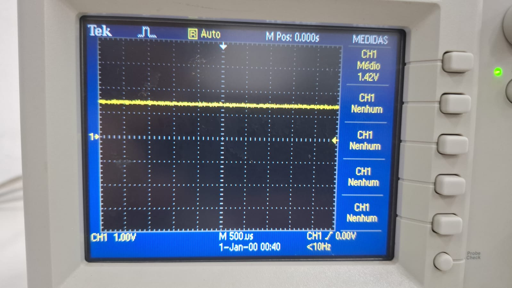
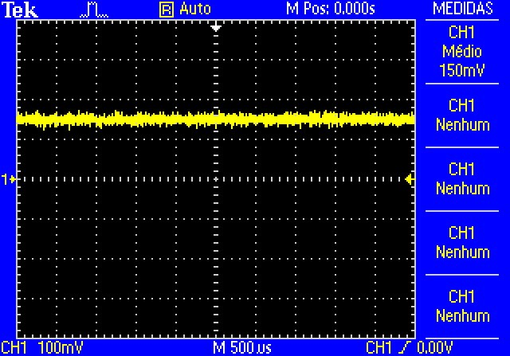
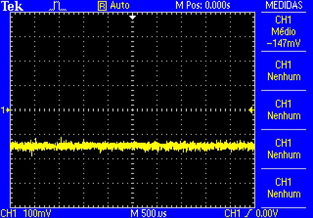
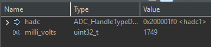
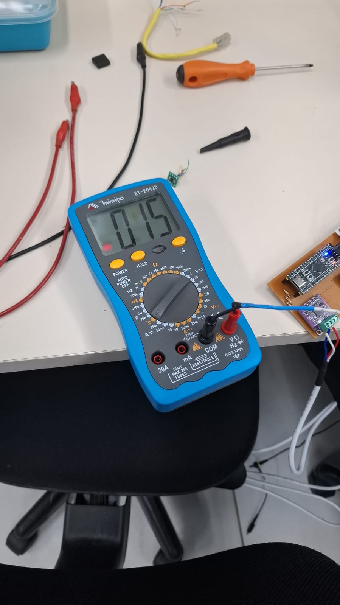
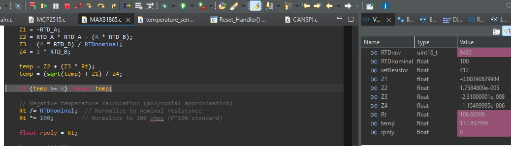
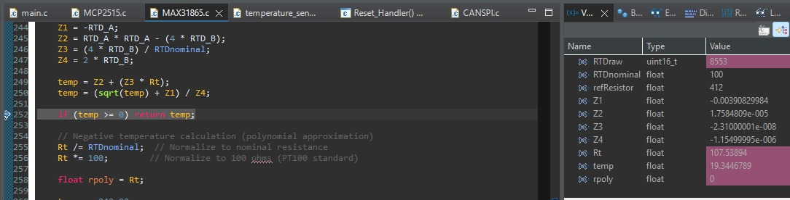

Etapa 4
#######

.. contents::
   :local:
   :depth: 2

Visão geral
***********

A Etapa 4 abordará projeto do layout e montagem da placa de circuito impresso que abriga o sistema embarcado. A partir da montagem da PCB serão verificados os critérios de desempenho definidos na Etapa 3, juntamente a validação do sistema e integridade dos dados no barco.

Desenvolvimento
***************

Layout da PCB
=============

Para a elaboração do *layout* foram priorizados os seguintes aspectos:

+ Alta densidade de componentes, visando aproveitar o espaço limitado;
+ Segmentação da placa em áreas relacionadas à potência (dissipação de calor e emissão de EMI), tratamento de sinais analógicos e trilhas de sinais digitais;
+ Dedicação de um plano de referência exclusivo para o condicionamento do sinal proveniente do sensor de corrente (visando diminuir erros e aumentar a precisão);
+ Priorização de componentes SMD;
+ As regras de desenho devem ser compatíveis com os limites da CNC do LPAE(IFSC);
+ Placa de face dupla, sendo a camada superior majoritariamente um plano de referência sólido.

Observando as condições de manufatura do IFSC, foram priorizados componentes SMD de tamanho mínimo equivalente ao encapsulamento SOIC para os circuitos integrados e 0805 para capacitores e resistores. O projeto desenvolvido no KiCad pode ser visualizado em: `Link para a versão 1 do projeto <https://github.com/GabrielMarodin/sensor-temperatura-corrente-can/tree/main/etapa_3/PCB/Modulo_corrente_temperatura_barco_Zenite>`_ .

No entanto, alguns componentes estavam indisponíveis e adaptações foram necessárias, como pode ser observado na imagem abaixo.

.. image:: images/layoutCompair.png
   :scale: 30 %

O amplificador operacional TLV9004, inicialmente idealizado, foi substituído pelo TLV2376, em um encapsulamento menor, mas plenamente compatível com os requisitos do projeto. A substituição também ocorreu com o filtro ativo anteriormente previsto que foi trocado por um filtro passivo RC passa-baixa. O *layout* adaptado no KiCad pode ser visualizado em: `Link para a versão 2 do projeto <https://github.com/GabrielMarodin/sensor-temperatura-corrente-can/tree/main/etapa_3/PCB/Modulo_corrente_temperatura_barco_Zenite-V02>`_ .

Montagem da PCB
===============

A fabricação da PCB foi realizada no LPAE com o auxílio de seus técnicos e professores para a operação da CNC. O projeto impresso corresponde à `versão 2 <https://github.com/GabrielMarodin/sensor-temperatura-corrente-can/tree/main/etapa_3/PCB/Modulo_corrente_temperatura_barco_Zenite-V02>`_ . No entanto, algumas modificações foram necessárias, como o corte manual das trilhas e pads do amplificador operacional, além da utilização da técnica de *wire up* para integrar o circuito integrado à placa.

A PCB montada pode ser visualizada nas imagens abaixo:

.. image:: images/PCB_V2_Assembled_top.png
   :scale: 30 %
   
.. image:: images/PCB_V2_Assembled_bottom.png
   :scale: 30 %

Nota-se nas imagens que há muitos espaços não ocupados por componentes. Esses espaços correspondem a elementos que não estavam disponíveis no momento da montagem, mas que poderão ser inseridos posteriormente, assim que houver disponibilidade. Observa-se também a presença de diversos fios de cobre nu esmaltado na parte inferior da placa. Esses fios foram utilizados para interconectar as ilhas de GND, uma vez que não foi possível fabricar a placa em dupla face e garantir o plano de referência sólido originalmente previsto.

Validação da Aplicação
======================

Validação do Desempenho
***********************

Sensor Hall
======================

O sensor de efeito Hall lido pelo ADC com offset teve os seguintes resultados:

A figura mostra o valor real medido do offset no divisor resistivo.

A figura mostra o valor de tensão com corrente positiva no shunt de 16 Ohms do sensor de corrente.

A figura mostra o valor de tensão com corrente negativa no shunt de 16 Ohms do sensor de corrente.

A figura mostra o valor lido e convertido utilizando a fórmula `previamente exposta na etapa 2 <../etapa_2/README.rst#L55>`_.

Pode-se concluir que há uma variação de 3 mA o que era esperado para a resolução de 10 bits mais as não idealidades propagadas.

Sensor de temperatura
======================

O sensor temperatura lido pelo SPI da breakout board MAX31865 teve os seguintes resultados:

A figura mostra a temperatura ambiente no momento de teste.

A figura mostra a temperatura lida e calculada do PT100.

A figura mostra a temperatura do PT100 depois de um tempo em contato com a mão.

O ADC do MAX31865 é de 16 bits com 15 bits de RTD a resolução é alta e o maior fator de erro é o valor do resistor de referência, alterar a macro do software do [RREF] para o valor medido com um multímetro na hora 
afeta a exatidão da temperatura dastricamente.

Estimativas de processamento e desempenho do MCU
======================
Não houve tempo de executar testes quantitativos do processamento da CPU, portanto foram feitas estimativas baseadas
no tempo médio dos processos mais lentos de cada tarefa e gastos típicos de corrente e ocupação da CPU.

O período de ativação das tarefas é muito maior que o tempo de execução da tarefa mais lenta o que permite dizer que o sistema
não tem dificuldade em atender as deadlines e mesmo assim ele é soft real-time considerando que perdas de dados ocasionais não
causarão falhas críticas no sistema em que está embarcado.

Tempo de execução de cada tarefa
--------------------------------

+------------------+-----------------------------------------------+----------------------+
| Tarefa           | Descrição                                     | Tempo estimado       |
+==================+===============================================+======================+
| CurrentTask      | Processamento do buffer ADC                   | 20–60 µs             |
+------------------+-----------------------------------------------+----------------------+
| CANCurrentTask   | Cálculo RMS, pico e envio CAN                 | 180–350 µs           |
+------------------+-----------------------------------------------+----------------------+
| RTDTask          | Leitura de três sensores MAX31865             | 200–225 ms           |
+------------------+-----------------------------------------------+----------------------+
| CANTempTask      | Empacotamento e envio CAN                     | 70–120 µs            |
+------------------+-----------------------------------------------+----------------------+

Tempo de ocupação da CPU
--------------------------------

+---------------------------+----------------+
| Componente                | Utilização     |
+===========================+================+
| Processamento ADC         | 1–3 %          |
+---------------------------+----------------+
| Cálculo da corrente RMS   | 2–5 %          |
+---------------------------+----------------+
| Driver CAN                | < 1 %          |
+---------------------------+----------------+
| Escalonador FreeRTOS      | < 1 %          |
+---------------------------+----------------+
| Processamento RTD         | < 1 %          |
+---------------------------+----------------+
| Total estimado            | 5–10 %         |
+---------------------------+----------------+
| CPU ociosa                | 90–95 %        |
+---------------------------+----------------+

Medição do WCET (Worst-Case Execution Time)
--------------------------------

+------------------+----------------------+------------------------------+
| Tarefa           | WCET estimado        | Observação                   |
+==================+======================+==============================+
| CurrentTask      | 60 µs                | Filtragem e cópia DMA        |
+------------------+----------------------+------------------------------+
| CANCurrentTask   | 350 µs               | Inclui cálculo RMS e CAN     |
+------------------+----------------------+------------------------------+
| RTDTask          | 225 ms               | Inclui atrasos HAL_Delay()   |
+------------------+----------------------+------------------------------+
| CANTempTask      | 120 µs               | Montagem e transmissão CAN   |
+------------------+----------------------+------------------------------+
| RTDTask (CPU)    | 300–500 µs           | Desconsiderando HAL_Delay()  |
+------------------+----------------------+------------------------------+

Eficiência energética da placa
--------------------------------

+--------------------------------+-----------------------------+
| Parâmetro                      | Valor estimado              |
+================================+=============================+
| Frequência do processador      | 84 MHz                      |
+--------------------------------+-----------------------------+
| Consumo típico do STM32F4      | 25–35 mA @ 3,3 V            |
+--------------------------------+-----------------------------+
| Potência estimada do MCU       | 80–115 mW                   |
+--------------------------------+-----------------------------+
| Utilização média da CPU        | 5–10 %                      |
+--------------------------------+-----------------------------+
| Tempo ocioso da CPU            | 90–95 %                     |
+--------------------------------+-----------------------------+
| Uso de DMA                     | Sim                         |
+--------------------------------+-----------------------------+
| Uso de filas do FreeRTOS       | Sim                         |
+--------------------------------+-----------------------------+
| Polling contínuo               | Não                         |
+--------------------------------+-----------------------------+
| Classificação da eficiência    | Alta                        |
+--------------------------------+-----------------------------+

Verificação da Integridade dos Dados
====================================

Referências (links/datasheets/livros)
*************************************

- `Código de interface MCP2515 <https://github.com/eziya/STM32_SPI_MCP2515/tree/master>`_

- `Datasheet do MCP2515 <https://www.microchip.com/en-us/product/mcp2515>`_

- `Datasheet do MAX31865 <https://www.analog.com/media/en/technical-documentation/data-sheets/max31865.pdf>`_

- `Datasheet do TLV2376 <https://www.ti.com/product/TLV2376/part-details/TLV2376IDGKR>`_

- `Datasheet do TJA1050 <https://www.nxp.com/docs/en/data-sheet/TJA1050.pdf>`_

- `Fundamentos da camada física do CAN <https://www.ti.com/lit/an/slla270/slla270.pdf?ts=1783507668427>`_

- `GitHub do Zenite Solar <https://github.com/ZeniteSolar>`_

- `ARM Cortex-M4 Technical Reference Manual (DWT CYCCNT) <https://documentation-service.arm.com/static/5fce431be167456a35b36ade>`_

- `ARM Cortex-M4 Processor Datasheet <https://developer.arm.com/-/media/Arm%20Developer%20Community/PDF/Processor%20Datasheets/Arm%20Cortex-M4%20Processor%20Datasheet.pdf>`_

- `STM32F4 Series Documentation (Reference Manuals and Datasheets) <https://www.st.com/en/microcontrollers-microprocessors/stm32f4-series/documentation.html>`_

- `STM32F407/417 Documentation (Reference Manual RM0090 and Datasheets) <https://www.st.com/en/microcontrollers-microprocessors/stm32f407-417/documentation.html>`_
